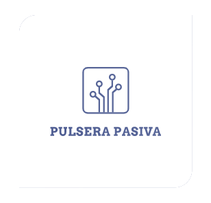
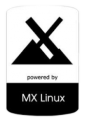

# Pulsera Pasiva

Insignia | Estado
--- | ---
**Version Actual** | 

Con este proyecto se desea poder crear una pulsera que pueda llevar el usuario a cualquier lugar de una manera poco llamativa, con sus datos identificativos que quiera facilitar, una apertura de puertas para su vivienda (como segundo factor de seguridad) y disponer de un pendrive USB donde poder llevar sus datos encriptados con un espacio donde poder almacenar archivos que necesite, y además una distribución de Linux totalmente funcional y encriptado para mayor seguridad, para usarla como sistema operativo de trabajo habitual o esporádico, según desee el usuario.

# DISTRIBUCIÓN

Para este proyecto usamos la distribución MX-LINUX....

# INSTRUCCIONES

En este manual explicaremos la forma de crear el USB tanto en windows como en cualquier version de Linux en la que trabajeis. Todas las herramientas a las que nos referimos estarán facilitadas en la carpeta tools

Para este uso, solo nos referiremos a USB con capacidades de:

64Gb: https://www.amazon.es/Memoria-Flash-SanDisk-Velocidad-Lectura/dp/B077VYCV37/ref=sr_1_2?__mk_es_ES=%C3%85M%C3%85%C5%BD%C3%95%C3%91&dchild=1&keywords=Sandisk+ultra+fit+usb+3.1+128gb&qid=1592234953&s=computers&sr=1-2-catcorr

o

128Gb: https://www.amazon.es/Memoria-Flash-SanDisk-Velocidad-Lectura/dp/B07855LJ99/ref=sr_1_1?__mk_es_ES=%C3%85M%C3%85%C5%BD%C3%95%C3%91&dchild=1&keywords=Sandisk+ultra+fit+usb+3.1+128gb&qid=1592234953&s=computers&sr=1-1-catcorr

Las de menor tamño sus capacidades de almacenaje no son optimos aunque si, funcionales, estas son las elegidas por mi para que después puedan ser mejor ubicadas dentro del compartimento de la pulsera y las de menor peso y durabilidad, debido a que son totalmente de plastico.

WINDOWS
Paso 1-. Particionado de disco Utilizaremos la herramienta Macrorit Disk Partition, en ella visualizaremos el USB que hemos conectado al PC.

·64Gb: Crearemos una partición FAT32 de 16Gb como principal en la parte final del dispositivo, siendo esta donde almacenaremos nuestra memoria usb como tal.

·128Gb: Crearemos una partición FAT32 de 64Gb como principal en la parte final del dispositivo, siendo esta donde almacenaremos nuestra memoria usb como tal.

Paso 2-. Instalación del S.O. preferido dentro del USB.

Para esto utilizaremos una maquina virtual de VirtualBox

# Licencia
Ver la [LICENCIA](LICENSE.md) del archivo de derechos de licencia y limitaciones (MIT).
