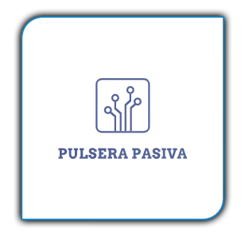

# Pulsera Pasiva

Insignia | Estado
--- | ---
**Version Actual** | 

Con este proyecto se desea poder crear una pulsera que pueda llevar el usuario a cualquier lugar de una manera poco llamativa, con sus datos identificativos que quiera facilitar, una apertura de puertas para su vivienda (como segundo factor de seguridad) y disponer de un pendrive USB donde poder llevar sus datos encriptados con un espacio donde poder almacenar archivos que necesite, y además una distribución de Linux totalmente funcional y encriptado para mayor seguridad, para usarla como sistema operativo de trabajo habitual o esporádico, según desee el usuario.

# DISTRIBUCIÓN

Para este proyecto usamos la distribución MX-LINUX....

# INSTRUCCIONES

En este manual explicaremos la forma de crear el USB tanto en windows como en cualquier version de Linux en la que trabajeis. Todas las herramientas a las que nos referimos estarán facilitadas en la carpeta tools

Para este uso, solo nos referiremos a USB con capacidades de:

64Gb: https://www.amazon.es/Memoria-Flash-SanDisk-Velocidad-Lectura/dp/B077VYCV37/ref=sr_1_2?__mk_es_ES=%C3%85M%C3%85%C5%BD%C3%95%C3%91&dchild=1&keywords=Sandisk+ultra+fit+usb+3.1+128gb&qid=1592234953&s=computers&sr=1-2-catcorr

o

128Gb: https://www.amazon.es/Memoria-Flash-SanDisk-Velocidad-Lectura/dp/B07855LJ99/ref=sr_1_1?__mk_es_ES=%C3%85M%C3%85%C5%BD%C3%95%C3%91&dchild=1&keywords=Sandisk+ultra+fit+usb+3.1+128gb&qid=1592234953&s=computers&sr=1-1-catcorr

Las de menor tamño sus capacidades de almacenaje no son optimos aunque si, funcionales, estas son las elegidas por mi para que después puedan ser mejor ubicadas dentro del compartimento de la pulsera y las de menor peso y durabilidad, debido a que son totalmente de plastico.

WINDOWS
Paso 1-. Particionado de disco Utilizaremos la herramienta Macrorit Disk Partition, en ella visualizaremos el USB que hemos conectado al PC.

·64Gb: Crearemos una partición FAT32 de 16Gb como principal en la parte final del dispositivo, siendo esta donde almacenaremos nuestra memoria usb como tal.

·128Gb: Crearemos una partición FAT32 de 64Gb como principal en la parte final del dispositivo, siendo esta donde almacenaremos nuestra memoria usb como tal.

Paso 2-. Instalación del S.O. elegido (Mx-Linux) dentro del USB.

Para esto utilizaremos una maquina virtual de VirtualBox, simplente descomprimimos el programa y lo abrimos. Una vez en ejecución,  pulsamos en iniciar y se abrirá una ventana en la que veremos el grub, seleccionamos con F2 nuestro lenguaje y pulsamos intro e iniciamos el sistema. cuabdo haya iniciado por completo, procedemos a su instalación.

Antes de comenzar la instalación debemos de añadir el USB a la maquina visrtual, pulsando en DISPOSITIVOS y pulsamos sobre nuestro USB para que lo detecte como introducido al sistema.

Para la instalación cuando lleguemos al apartado de particiones, debemos de realizar dos particiones usando el gestor que trae el instalador:

a) partición 1: 500mb para el boot
b) pqrtición 2:  resto del almacenamiento

Una vez particionado, seleccionamos primeramente el boot y en segundo lugar el root, pulsando sobre la oestaña de encriptado y asignandole un nombre comprensible.

Vamos aceptando y introduciendo los datos que nos solicita hasta completar la insyalación.

Ahora reiniciamos el sistema y arrancamos el PC desde el USB. Normalmente para esto debemos configurar la BIOS para poder hacerlo y en otras ocasiones con pulsar la tecla F12 al iniciar el sistema podemos seleccionar el inicio preferido debiendo seleccionar nuestro USB.

Paso 3.- Poner a punto la distribución

Una vez el sistema este iniciado procedemos a ejecutar el script (postinstalacion.sh) que encontraremos en la carpeta tools.

Una vez finalizado ya puedes disfrutar de tu USB totalmente optimizado y disponible para su uso. Ahora puedes personalizarla a tu gusto.

# PULSERA

Esta pulsera para mejor visión y durabilidad debería de estar creada en cuero.

Se proporcionan las medidas exactas para que todo encaje perfectamente.

Por el momento no se proporcionan instrucciones sobre el dispositivo RFID, ni NFC. 

RFID: Debe de poder abrir una cerradura electronica, usada como seguro de la puerta principal de la vivienda.

NFC:  Proporciona a su lectura con cualquier dispositivo con dicha tecnología de la información básica del  usuario que la porta para los equipos de emergencia.

# Licencia
Ver la [LICENCIA](LICENSE.md) del archivo de derechos de licencia y limitaciones (MIT).
